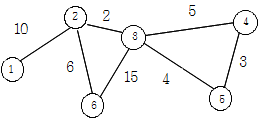

#2632 비용

------------
## 문제
```
간선(혹은 에지)에 가중치가 주어진 그래프가 있다. 
정점들의 수가 N일 때, 모든 정점은 1부터 N까지 번호가 붙여져 있고, 모든 간선들의 가중치는 서로 다르다. 

이때 서로 다른 두 정점 u,v에 대하여, Cost(u,v)는 다음에서 제거되는 간선들의 가중치 합이다: 
u와 v사이의 경로가 있으면 이 그래프의 최소 가중치 간선을 그래프에서 제거한다. 
이 과정을 u와 v사이의 경로가 없을 때까지 반복한다.

예를 들어, 6개의 정점으로 이루어진 다음 그래프를 고려해 보자.
```

```
두 정점 2, 6에 대하여, Cost(2,6)을 구하는 과정에서 제거되는 간선들을 차례대로 나열하면 다음과 같다: 
(2, 3), (4, 5), (3, 5), (3, 4), (2, 6).

이들 간선들 중 (2, 6)이 제거될 때, 두 정점 2와 6사이의 경로가 없으므로 간선 제거가 끝나게 된다. 
따라서  Cost(2,6) = 2 + 3 + 4 + 5 + 6 = 20이다.

간선에 가중치가 있는 그래프가 주어질 때, u<v인 모든 두 정점 u,v에 대한 Cost(u,v)들의 총 합을 구하는 프로그램을 작성하시오. 
총 합이 10^9보다 크거나 같으면 이를 10^9으로 나눈 나머지를 출력한다.
```

------------
## 입력
```
첫 번째 줄에 정점의 수 N (1<=N<=100,000)과 간선의 수 M (1<=M<=100,000)이 빈칸을 사이에 두고 주어진다. 
다음 M개의 각 줄에 간선 하나에 대한 정보를 나타내는 세 개의 양의 정수 x,y,w가 빈칸을 사이에 두고 주어진다. 
이는 간선 (x,y)의 가중치가w 임을 의미한다. 
1<=w<=100,000이다.
```
------------
## 출력
```
u<v인 모든 두 정점 에 대한 Cost(u,v)들의 총 합을 첫째 줄에 출력한다. 
단, 총 합이 10^9보다 크거나 같으면 이를 10^9으로 나눈 나머지를 출력한다.
```
----------
### 예제 입력1

```
6 7
1 2 10
2 3 2
4 3 5
6 3 15
3 5 4
4 5 3
2 6 6
```
-------
### 예제 출력1
```
256
```

----------
