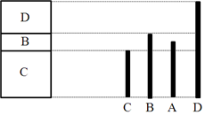

#2515 전시장

------------
## 문제
```
전시장에서 그림을 판매하는 업체에 하나의 전시대가 배정된다. 전시될 그림은 직사각형의 모양을 가지고 있고, 
그림의 높이는 다를 수 있지만 폭은 모두 동일하다고 가정한다. 각 그림에는 가격이 매겨져 있다.
```

```
업체는 그림들을 관람객에게 보이기 위해 전시대에 배치하는데, 전시대의 폭이 그림의 폭과 동일하여 겹쳐서 배치해야만 한다. 
예를 들어, 위의 그림은 전시대에 네 개의 그림 A, B, C, D를 C, B, A, D의 순서로 겹쳐서 배치한 상황을 보여준다.
위 그림의 오른쪽 부분은 전시된 그림들의 배치를 옆에서 본 모양을 나타내고, 
왼쪽 부분은 배치한 그림들을 앞에서 보아서 관람객들이 보게 될 모양을 나타낸다. 
그림 A는 앞의 그림 B때문에 가려져서 관람객에게 전혀 보이지 않고, 부분적으로라도 보이는 그림은 B, C, D 뿐이다. 
보이는 부분의 세로 길이가 특정 정수 S이상인 그림만 관람객이 관심을 보이고 사게 된다고 가정한다. 
전시된 그림들 중 보이는 부분의 세로 길이가 S이상인 그림을 판매가능 그림이라고 부른다. 
그림의 높이와 가격이 주어질 때, 판매가능 그림들의 가격의 합이 최대가 되도록 그림을 배치할 때, 그 최대합을 구하는 프로그램을 작성하시오. 
```

------------
## 입력
```
첫째 줄에는 그림의 개수 N (1<=N<=300,000)과 판매가능 그림을 정의하는 1이상의 정수 S가 빈칸을 사이에 두고 주어진다. 
다음 이어지는 N개의 줄 각각에는 한 그림의 높이와 가격을 나타내는 정수 H와 C가 빈칸을 사이에 두고 주어진다. 
단, 1 ≤ S ≤ H ≤ 20,000,000, 1 ≤ C ≤ 1,000이다. 
```
------------
## 출력
```
첫째 줄에 판매가능 그림들의 가격의 합이 최대가 되도록 배치했을 때 그 최대 합을 출력한다. 
```
----------
### 예제 입력1

```
6 4
15 80
8 230
10 100
17 200
20 75
26 80
```
-------
### 예제 출력1
```
510
```

----------
### 예제 입력1

```
5 6
5 8
1 2
6 4
7 8
9 7
```
-------
### 예제 출력1
```
10
```
----------
### 예제 입력1

```
5 7
4 5
2 5
5 7
10 3
6 1
```
-------
### 예제 출력1
```
8
```
-----
