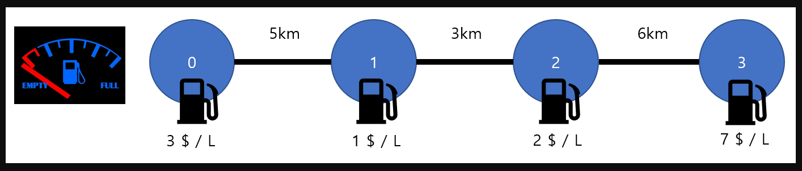
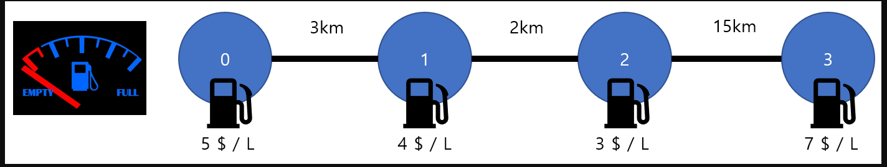

#주유비

------------
## 문제

```
일직선상에 N 개의 도시가 있다. 민코씨는 왼쪽 끝 도시에서 오른쪽 끝 도시까지 자동차를 타고 이동하려 한다.

도로는 도시 사이에 있으며 도로의 길이는 서로 다를 수 있다. 또한 자동차는 처음에는 빈 연료통으로 시작하고 이동할 때는 1 km 당 1 L의 연료가 감소한다.
```
[그림1]

[그림2]

```
위 그림에서 원안에 수는 도시의 번호이고, 선분에 적힌 수는 도시와 도시사이의 거리이다.

또한 각 도시마다 주유소가 있어서 필요시 연료통의 용량을 넘지 않게 급유를 할 수 있다. 단, 각 도시마다 주유비용이 다르다.

이처럼 주유비용이 주유소마다 다르기 때문에 민코씨는 최소한의 비용으로 이동을 하려 한다.

민코씨가 연료통의 용량을 넘지 않도록 주유를 하며 최소한의 비용으로 도착하기 위한 가격을 구하는 프로그램을 작성하세요.


예를들어, 그림 1 에서 연료통의 용량이 8 이라고 하면 최소 비용은 25 이다.

그림 2 에서 연료통 용량이 15 라고 하면 최소 비용은 68이다. 만약 연료통 용량이 15보다 작다면 이동이 불가능하다.
```
------------
## 입력
```
첫째 줄에 테스트 케이스의 개수 T 가 주어지고, 이후 차례로 T개 테스트 케이스가 주어진다. ( 1 <= T <= 40)

각 케이스의 첫째 줄에는 도시의 개수 N 과 연료통의 용량 L 이 주어진다. ( 2 <= N <= 2000 , 1 <= L <= 50)


둘째 줄에는 주유비용에 해당하는 값이 0번 지역부터 N - 1번지역순으로 총 N개 차례대로 주어진다.

주유비용은 1 이상 1000 이하의 자연수이다.


셋째 줄에는 도로의 거리가 입력된다. 도로의 거리는 0번지역에서 나가는 도로 , 1번지역에서 나가는 도로, 2번 지역에서 나가는 도로.... 이렇게 순서대로 총 N-1 개 주어진다.

도로의 길이는 1 이상 1000 이하의 자연수이다.
```
------------
## 출력
```
각각의 테스트 케이스에 대하여

만약 이동 불가능시 impossible 을 출력하고

그게 아니면 왼쪽 도시에서 오른쪽 도시로 가는 최소비용을 출력한다.
```
----------
### 예제 입력1

```
3
4 14
5 4 3 7
3 2 15
4 15
5 4 3 7
3 2 15
4 8
3 1 2 7
5 3 6 
```
-------
### 예제 출력1
```
impossible
68
25
```
-----
